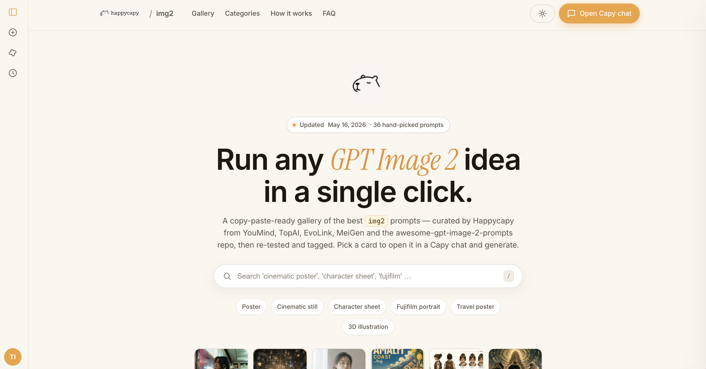

# GPT Image 2 Prompts · Curated Gallery

A copy-paste-ready gallery of **36 hand-picked GPT Image 2 (img2) prompts** — curated by [Happycapy](https://www.happycapy.ai) from YouMind, TopAI, EvoLink, MeiGen, and the `awesome-gpt-image-2-prompts` community repo, then re-tested and tagged.

Pick a card, copy the prompt, or send it straight into a Capy chat to generate.

**Live demo:** https://tiange2211123.github.io/gpt-image-2-prompts/



---

## What's inside

- **36 curated prompts** across 13 categories — cinematic stills, character sheets, posters, packaging, 3D illustration, fujifilm portraits, infographics, and more
- **Real GPT-Image-2 previews** — every card ships with an actual generated image, not a placeholder
- **4 difficulty tiers** — Easy / Medium / Advanced / Expert
- **Filterable & searchable** — by category, difficulty, tags, or full-text query
- **Aspect-ratio aware** — cards keep the prompt's intended aspect (1:1, 4:5, 9:16, 16:9, 3:2, 2:3 …)
- **One-click "Try in Capy"** — opens the prompt pre-filled in a Happycapy chat
- **100% static** — no build step, no dependencies, no tracker. Open `index.html` from a local server and you're done.

## Using locally

```bash
git clone https://github.com/TIANGE2211123/gpt-image-2-prompts.git
cd gpt-image-2-prompts
python3 -m http.server 8000
# open http://localhost:8000
```

> Don't double-click `index.html` — `fetch('data/prompts.json')` is blocked under the `file://` protocol. Always serve over HTTP.

## File structure

```
gpt-image-2-prompts/
├── index.html              # entry point
├── css/styles.css          # Happycapy cream/amber theme + dark mode
├── js/app.js               # gallery rendering, search, filter, chat panel
├── data/prompts.json       # the 36 prompts + metadata
├── images/                 # preview thumbnails (one per prompt)
├── assets/                 # Happycapy brand icon + lockup
└── fonts/                  # Inter, Instrument Serif, JetBrains Mono (self-hosted)
```

## Prompt schema

Each entry in `data/prompts.json` looks like:

```json
{
  "id": "01-cinematic-still",
  "title": "Cinematic still — neon back-alley",
  "description": "A moody, anamorphic-lens still …",
  "prompt": "A cinematic still of …",
  "category": "cinematic",
  "tags": ["noir", "neon", "anamorphic"],
  "model": "gpt-image-2",
  "aspect_ratio": "16:9",
  "difficulty": "medium",
  "preview_image_url": "images/01-cinematic-still.jpg",
  "source_site": "youmind.com",
  "featured": true,
  "trending_score": 92
}
```

## Sources & credits

Prompts were collected and adapted from:

- [YouMind](https://youmind.com)
- [TopAI](https://topai.ink)
- [EvoLink](https://evolink.ai)
- [`awesome-gpt-image-2-prompts`](https://github.com/) community curation

All preview images were re-generated locally with GPT Image 2 to match the prompt as written.

Brand styling, type system, and the "Try in Capy" deep-link are by [Happycapy](https://www.happycapy.ai).

## Contributing

PRs welcome. To add a prompt:

1. Append a new entry to `data/prompts.json` following the schema above
2. Drop a 1024-pixel preview JPG into `images/<id>.jpg`
3. Update `meta.total` and bump `meta.updated_at`

## License

[MIT](LICENSE) © 2026 Happycapy

The prompts themselves are aggregated from public sources and reproduced for educational and reference purposes; please credit the original authors when you reuse them at scale.
